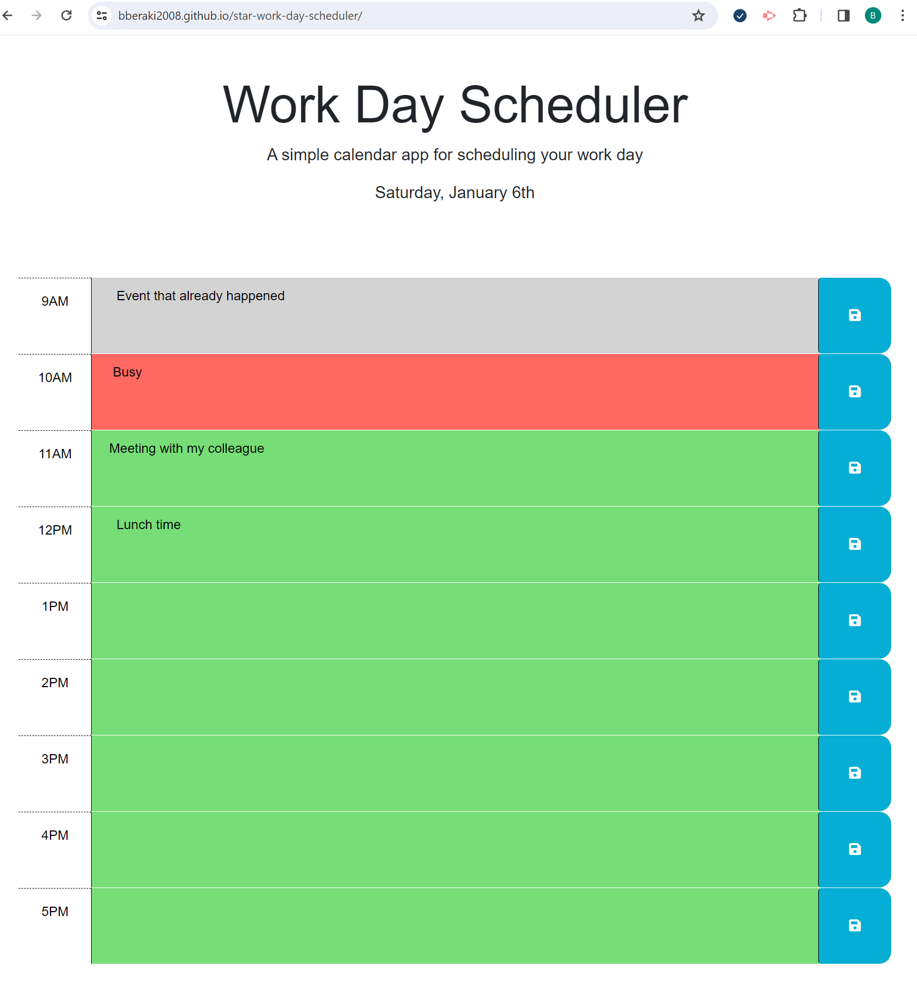

# Star Work Day Scheduler

## Work Day Scheduler

## Description

An employee or any consumer with a busy schedule can use the Star Work Day Scheduler to add important events to thier daily planner
so that they can manage their time effectively. When you open the planner with any browser, the current day will be displayed at the top of
calendar. Time blocks for standard business hours of 9am to 5pm of that day will presented after scrollind down. Each time block is
color-coded to indicate whether it is in the past, present, or future. You can enter an event by clicking into a time block and click the save
button for that time block for that event to be saved in local storage. When refresh the page the saved envents persist.

## Installation

N/A

## Usage

To use this site of work day scheduler, you can open it with the most popular browser such as Google Chrome, Firefox (Mozilla), Edge and so on...

## Credits

N/A

## links to the APP

https://bberaki2008.github.io/star-work-day-scheduler/

## Screenshot

## License

Please refer to the LICENSE in the repo.
